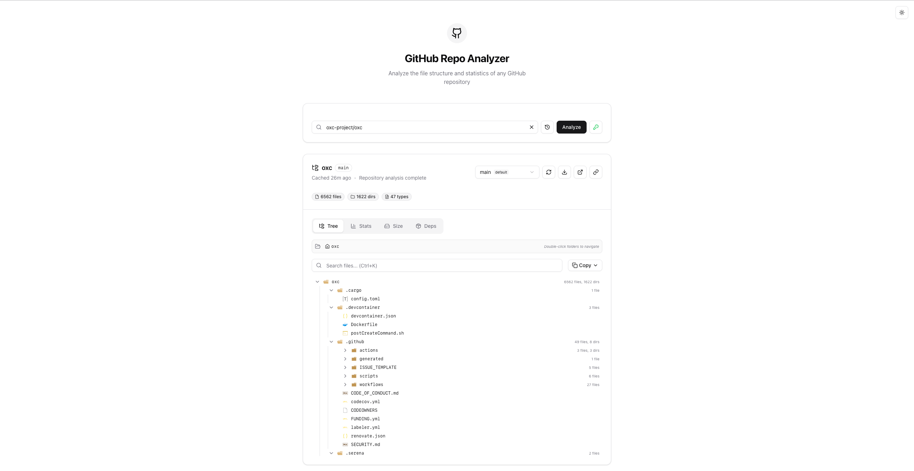

<p align="center">
  
</p>

# GitHub Repo Analyzer

A powerful web tool to analyze, visualize, and explore the file structure of any public GitHub repository. Get instant insights into repository composition, file sizes, dependencies, and more.

<p align="center">
  
</p>

## Features

### Repository Analysis

- **Flexible Input** - Enter `owner/repo` or paste a full GitHub URL
- **Branch & Tag Selection** - Analyze any branch or tag, not just the default
- **Large Repo Support** - Navigate folder-by-folder for repositories with 100k+ files
- **Smart Caching** - Results are cached locally to reduce API calls and speed up repeat visits

### Interactive File Tree

- **Expandable Directory Tree** - Click to expand/collapse folders
- **VS Code File Icons** - Beautiful icons for 40+ file types
- **Search & Filter** - Find files instantly with real-time filtering
- **Copy as Text** - Export the tree structure as ASCII art for documentation
- **Folder Navigation** - Drill into subdirectories for large repositories

### Statistics & Insights

- **File & Folder Counts** - Total files, directories, and unique file types
- **File Type Distribution** - Visual bar chart showing composition by extension
- **Size Analysis** - Total size, average file size, and top 10 largest files
- **Lines of Code Estimate** - Rough LOC breakdown by language
- **Donut Chart** - Interactive visualization of file type percentages

### Dependency Detection

Automatically detects and displays project dependencies from:

- `package.json` (Node.js/npm)
- `requirements.txt` (Python)
- `Cargo.toml` (Rust)
- `go.mod` (Go)
- `Gemfile` (Ruby)
- `pom.xml` / `build.gradle` (Java)
- `pubspec.yaml` (Dart/Flutter)

### Branch Comparison

Compare file structures between two branches:

- See added, removed, and common files
- Summary statistics for quick overview
- Identify structural changes at a glance

### Sharing & Export

- **Shareable URLs** - Copy a link that auto-loads the repository
- **Export as JSON** - Download complete analysis data
- **Open in GitHub** - Quick link to view the repo on GitHub

### User Experience

- **Recent Repositories** - Quick access to your last 10 analyzed repos
- **Keyboard Shortcuts** - Power user navigation (`/` to focus input, `Cmd+K` for search)
- **Rate Limit Indicator** - See remaining GitHub API calls
- **Dark/Light/System Theme** - Adapts to your preference
- **Mobile Friendly** - Responsive design works on all devices

## Tech Stack

- **React 19** + **TypeScript**
- **Vite 8**
- **Tailwind CSS v4**
- **shadcn/ui** components
- **Recharts** for visualizations
- **GitHub REST API**

## Getting Started

```bash
# Clone the repository
git clone https://github.com/user/github-repo-analyzer.git
cd github-repo-analyzer

# Install dependencies
pnpm install

# Start development server
pnpm dev
```

## Usage

1. Enter a GitHub repository (e.g., `oxc-project/oxc`)
2. Click **Analyze** or press Enter
3. Explore the file tree, statistics, and dependencies
4. Switch branches, filter files, or export data as needed

## API Rate Limits

- **Unauthenticated**: 60 requests/hour
- The rate limit indicator shows your remaining quota

## License

MIT
